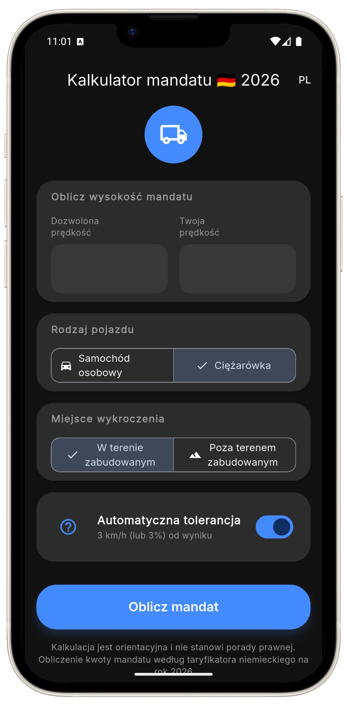

# 🚛 FineTruck DE - Kalkulator Mandatów Niemcy 2026

<div align="center">



**Twój osobisty asystent prawny na niemieckich drogach**

[](https://finetruck.de)
[]()
[]()

</div>

---

## 📋 Spis treści

- [O projekcie](#-o-projekcie)
- [Funkcje](#-funkcje)
- [Technologie](#-technologie)
- [Struktura projektu](#-struktura-projektu)
- [Uruchomienie lokalnie](#-uruchomienie-lokalnie)
- [Zrzuty ekranu](#-zrzuty-ekranu)
- [Roadmap](#-roadmap)
- [Autor](#-autor)
- [Licencja](#-licencja)

---

## 🎯 O projekcie

**FineTruck DE** to nowoczesna strona internetowa promująca aplikację mobilną do obliczania mandatów drogowych w Niemczech. Projekt został stworzony z myślą o kierowcach zawodowych i właścicielach firm transportowych, którzy potrzebują szybkiego i precyzyjnego narzędzia do weryfikacji wysokości kar za wykroczenia drogowe.

### 🌟 Dlaczego FineTruck DE?

- ✅ **Aktualne dane** - baza mandatów zgodna z Bußgeldkatalog 2026
- ✅ **Szybkie obliczenia** - wynik w ułamku sekundy
- ✅ **Dedykowane tryby** - osobówki i pojazdy ciężarowe
- ✅ **Automatyczna tolerancja** - uwzględnia prawne 3 km/h lub 3%
- ✅ **Bez reklam** - czyste i intuicyjne doświadczenie

---

## ⚡ Funkcje

### 🌐 Strona internetowa

- **Responsywny design** - doskonale wygląda na wszystkich urządzeniach
- **Dark Mode** - tryb ciemny dostosowany do preferencji systemowych
- **Dwujęzyczność** - interfejs PL/DE z dynamicznym przełączaniem
- **Animacje** - płynne animacje i efekty 3D
- **SEO-friendly** - zoptymalizowana pod kątem wyszukiwarek

### 📱 Aplikacja mobilna (promowana)

- Kalkulator mandatów 2026
- Tryby dla samochodów osobowych i ciężarowych
- Automatyczne odejmowanie tolerancji
- Offline mode
- Prosty i intuicyjny interfejs

---

## 🛠 Technologie

Projekt wykorzystuje nowoczesny stack technologiczny:

| Technologia | Zastosowanie |
|------------|-------------|
|  | Struktura strony |
|  | Stylowanie i responsywność |
|  | Interaktywność i logika |
|  | Typografia (Inter) |

### Dodatkowe funkcjonalności:

- **Tailwind CSS** (CDN) - utility-first CSS framework
- **Custom animations** - keyframes dla efektów float i fade-in
- **Dark mode** - wsparcie dla preferencji systemowych
- **i18n** - własny system tłumaczeń PL/DE

---

## 📁 Struktura projektu

```
finetruckde_website/
├── index.html              # Główny plik strony
├── CNAME                   # Konfiguracja domeny niestandardowej
├── GEMINI.md              # Dokumentacja dodatkowa
├── .gitignore             # Pliki ignorowane przez Git
└── assets/                # Zasoby multimedialne
    ├── flutter_01-portrait.webp      # Mockup aplikacji
    ├── lkw_calculator.webp           # Preview kalkulatora LKW
    ├── bag_control.webp              # Preview kontroli BAG
    ├── jail_driver.webp              # Preview komunikatu karnego
    ├── family_visit.webp             # Preview funkcji
    └── tachograph_smash.webp         # Preview funkcji tachografu
```

---

## 🚀 Uruchomienie lokalnie

### Wymagania wstępne

- Przeglądarka internetowa (Chrome, Firefox, Safari, Edge)
- (Opcjonalnie) Lokalny serwer HTTP

### Metoda 1: Bezpośrednie otwarcie

```bash
# Sklonuj repozytorium
git clone https://github.com/zanies/finetruckde_website.git

# Przejdź do katalogu
cd finetruckde_website

# Otwórz plik index.html w przeglądarce
open index.html  # macOS
start index.html # Windows
xdg-open index.html # Linux
```

### Metoda 2: Python HTTP Server

```bash
# Python 3.x
python -m http.server 8000

# Otwórz w przeglądarce: http://localhost:8000
```

### Metoda 3: Node.js Live Server

```bash
# Zainstaluj live-server globalnie (jeśli nie masz)
npm install -g live-server

# Uruchom serwer
live-server
```

---

## 📸 Zrzuty ekranu

<div align="center">

### 🌅 Tryb jasny


### 🌙 Dark Mode
Strona automatycznie dostosowuje się do preferencji systemowych

### 🌍 Wersja niemiecka
Pełne wsparcie dla języka niemieckiego

</div>

---

## 🗺 Roadmap

### ✅ Zrealizowane

- [x] Responsywna strona internetowa
- [x] Dark mode
- [x] System tłumaczeń PL/DE
- [x] Animacje i efekty wizualne
- [x] Sekcja funkcji
- [x] Preloader

### 🔄 W trakcie (75% ukończone)

- [ ] **Taryfikator Czasu Pracy Kierowców**
  - Kompleksowe narzędzie do obliczania kar
  - Naruszenia przepisów o czasie jazdy i odpoczynku
  - Zgodność z Lenk- und Ruhezeiten

### 🔮 Planowane

- [ ] Wersja językowa EN
- [ ] Blog z aktualizacjami prawymi
- [ ] FAQ
- [ ] Newsletter
- [ ] Wersja iOS aplikacji

---

## 👨‍💻 Autor

**Mariusz Zaniewski**

- GitHub: [@zanies](https://github.com/zanies)
- Website: [finetruck.de](https://finetruck.de)

---

## 📄 Licencja

© 2026 FineTruck DE | Mariusz Zaniewski. Wszelkie prawa zastrzeżone.

Ten projekt jest własnością prywatną. Kopiowanie, dystrybucja lub modyfikacja bez zgody autora jest zabroniona.

---

## 🤝 Wsparcie

Jeśli masz pytania lub sugestie dotyczące projektu, skontaktuj się poprzez:

- 📧 Email: [kontakt@finetruck.de](mailto:kontakt@finetruck.de)
- 🌐 Website: [finetruck.de](https://finetruck.de)

---

<div align="center">

**Zbudowane z ❤️ dla kierowców w Niemczech**

[⬆ Powrót na górę](#-finetruck-de---kalkulator-mandatów-niemcy-2026)

</div>